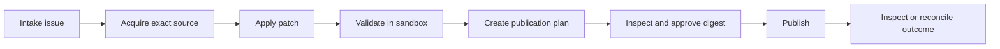

# Public contribution workflow

[Documentation home](../README.md) · [Getting started](GETTING_STARTED.md) ·
[Command reference](COMMAND_REFERENCE.md)

The `contribution` command family takes a public issue through source
acquisition, patch validation, exact publication approval and pull request
publication. The local-finding intake option currently has a ledger
compatibility mismatch; see [known limits](#limitations-to-inspect-before-choosing-this-workflow). `trio commands --json` provides the versioned machine
catalog. There is no built-in model or automatic agent launcher; a person or
separately chosen tool supplies the patch and proposed PR text.

## Prepare and validate

Use issue intake to select a public GitHub repository and issue.
Acquire resolves a precise base commit and obtains a complete public source tree.
Acquire and refresh have an explicit `--request-budget` (default 1000) covering
bounded Git object reads; an exhausted budget cannot produce a valid source seal.
Truncated trees, private repositories, unsupported symlinks/submodules and unsafe
paths must not become a valid source bundle. A caller-provided patch applies only
to contained regular files. Runtime state and Git administrative files do not
belong in contribution source.

Select a preinstalled sandbox image by immutable digest and explicit validation
commands appropriate to the project. Validation requires Podman. It runs with
network disabled, limited resources, no host home or credentials, no SSH/Git
helpers or container socket, and only the chosen public source. Do not run
repository tests or instructions directly on the host. Container output is
bounded and untrusted; a message saying tests passed is not a validation seal.

The host creates a seal only after actual command outcomes and exact resulting
source are verified. It binds repository/base, patch, resulting tree, validation
commands and results. Editing source or commands requires revalidation. A seal
cannot be created by importing team events or accepting a claimed test result.
A failing or incomplete validation does not authorize publication.

## Plan and publish

Prepare the precise destination, base, branch, title and body from a sealed
contribution. Inspect them, enable the required local repository/action policy,
and approve the exact plan digest. Choose a direct branch when authorized in the
upstream repository or a managed public fork when contributing externally.
Fork and branch identities remain explicit in the plan.

Publication uses GitHub's Git database and pull request APIs. It creates the
reviewed blobs/tree/commit, creates the designated branch without force,
and creates the pull request. Existing unrelated branches are not overwritten.
The transport verifies current identities, public visibility, permissions and
base/head facts before effects. It must preserve unrelated files in the complete
base tree. [GitHub Git database API](https://docs.github.com/en/rest/git)

Fork creation may be asynchronous. Publication records phases and returns
pending or uncertain outcomes when it cannot prove completion. Read-only
reconciliation adopts only effects matching the exact repository, branch,
commit/tree and PR identity. It does not blindly repeat requests after a timeout
or infer success from matching PR body text.

## Revise or refresh

Revise explicitly selects the managed contribution and its expected PR/head;
prepare the new patch, validate it and obtain a fresh publication approval.
Unrelated branch changes invalidate the old authority. Refresh acquires the new
base and requires a patch that applies and passes validation against it; old
seals and approvals cannot be reused across base changes.

## Verification limits

Offline API fixtures cover publication behavior. The release qualification
records the actual sandbox exercise separately. Live GitHub mutation
verification is NOT_RUN; the release does not claim a public fork or PR was
created in a trial. Tokens and local account inventory are never contribution
source or release inputs.


## Command examples

These placeholders require your selected public repository, exact SHA and local
policy. `commands.json` is an explicit JSON array of argv arrays, for example
`[["python", "-m", "unittest", "discover", "-s", "tests"]]` for a project that
supports that command. Select commands after inspecting the public project.

```sh
trio --home STATE contribution intake --repository example/project --issue 42 --token-env TRIO_GITHUB_TOKEN --json
trio --home STATE contribution acquire --id CONTRIBUTION_ID --base BASE_SHA --base-branch main --token-env TRIO_GITHUB_TOKEN --json
trio --home STATE contribution patch --id CONTRIBUTION_ID --path change.patch --json
trio --home STATE contribution validate --id CONTRIBUTION_ID --commands commands.json --image APPROVED_IMAGE_DIGEST --json
trio --home STATE contribution plan --id CONTRIBUTION_ID --branch contribution/fix --title 'Fix the reported behavior' --body pr-body.md --author-name 'Your Name' --author-email your-email@example.com --mode fork --fork-owner YOUR_LOGIN --token-env TRIO_GITHUB_TOKEN --json
trio --home STATE contribution inspect --id PUBLICATION_PLAN_ID --json
trio --home STATE contribution approve --id PUBLICATION_PLAN_ID --digest PLAN_DIGEST --actor operator --json
trio --home STATE contribution publish --id PUBLICATION_PLAN_ID --actor operator --token-env TRIO_GITHUB_TOKEN --json
trio --home STATE contribution reconcile --id PUBLICATION_PLAN_ID --token-env TRIO_GITHUB_TOKEN --json
trio commands --command 'contribution revise' --json
trio commands --command 'contribution refresh' --json
```

The policy must explicitly allow `contribution-publish` for the upstream stable
repository ID, the selected `mode` and `fork_owner` when using a fork. Declare
`contents:write` and `pull_requests:write`, approved sandbox image digests and
local approver/publisher roles. Enabling these local declarations does not grant
GitHub permissions; the live credential and repository must also allow the write.
Author name and email are supplied explicitly; Trio does not add an AI co-author
or assistant byline.

Refresh reacquires the explicitly selected base and reapplies the saved patch;
resolve conflicts before revalidation. Revise requires a managed prior PR and
creates a fresh exact plan. Both workflows need a new validation seal and approval.

## Before the walkthrough

You need initialized state, a read/write credential chosen by environment
variable name, Podman, and an image already installed locally and selected by
full `@sha256:` digest. The image must contain the project's required tools and
dependencies: validation has no network and does not pull or install them.
Use an existing public issue for the current walkthrough.

A full Git commit SHA is required for `--base`. It must match the selected
`--base-branch` when planning publication. Contribution commands acquire source
through GitHub APIs; they do not use your working directory as the source.
`change.patch` is a constrained unified text patch against that exact base,
and `pr-body.md` is the UTF-8 file containing the exact proposed PR body.

## Keep the IDs straight

| Placeholder | Obtain it from | Commands using it |
|---|---|---|
| `CONTRIBUTION_ID` | Intake result's `id` | show, acquire, patch, validate, plan, revise, refresh |
| `PUBLICATION_PLAN_ID` | Plan/revise result's `id` | inspect, approve, publish, reconcile |
| `PLAN_DIGEST` | Plan/revise result's `digest` | approve |
| `BASE_SHA` | Verified current commit for the selected upstream base branch | acquire, refresh |
| `APPROVED_IMAGE_DIGEST` | Preinstalled image identity explicitly permitted by local policy | validate |

The contribution ID and plan ID are different. Validation binds the contribution
source; approval binds the publication plan. Editing a patch or changing the
base invalidates the old validation/approval chain.

## Set up contribution policy

Use the [operations policy guide](OPERATIONS_GUIDE.md#configure-a-local-policy).
For a fork contribution, its repository entry additionally needs:

```json
{
  "repository_id": 456,
  "actions": ["contribution-publish"],
  "mode": "fork",
  "fork_owner": "YOUR_LOGIN"
}
```

Replace that synthetic repository ID and owner with verified values. The full
policy needs `publication_enabled: true`, the authenticated `identity_id`,
`contents:write` and `pull_requests:write` declarations, an approved digest in
`sandbox_images`, and local `approver`/`publisher` actors. Leave maintenance
disabled unless you separately intend to use it. Direct publication uses
`mode: "direct"` and requires live access to the upstream repository.

Plan creation itself checks the publication gate and seal. Configure the exact
reviewed policy before planning; a later policy change invalidates approval.
No gate or local role can grant GitHub permission or make a private source public.

## Follow the publication flow



The contribution ID follows the preparation steps. Plan creation returns a new
publication plan ID; that is the ID used for approval, publication, and recovery.
Validation failure stops the flow. A changed patch or base must pass validation
again before a fresh plan can be approved.

## Walkthrough and expected results

Follow the command examples above with your own values:

1. **Intake:** returns a contribution `id`, selected repository/identity, and
   queued stage. `contribution list` and `show` inspect local records.
2. **Acquire:** returns verified source at the exact base, under the explicit
   request budget. Partial or unsupported source cannot produce a seal.
3. **Patch:** applies the selected text patch to contained files; unrelated
   tracked source is retained.
4. **Validate:** runs the explicitly selected argv arrays in an offline
   container and records results. Success creates a host-issued seal; failure
   invalidates a previous seal. Use `--timeout`, `--memory-mb`, `--pids`, and
   `--cpus` for limits appropriate to the project.
5. **Plan:** returns a separate plan `id` and `digest`, exact commit/tree,
   destination, branch, title, body, author, base, and seal binding.
6. **Inspect:** read the complete `plan` with a sufficiently large response
   budget, for example `--max-bytes 65536`.
7. **Approve:** use the plan ID/digest and an actor with `approver` capability.
   The earlier generic examples use `operator`; with the guide's two-role
   policy use `--actor reviewer` for approve and `--actor operator` for publish.
8. **Publish:** uses the plan ID and publisher capability. Inspect the journal;
   an accepted asynchronous fork or uncertain request is not completion.
9. **Reconcile:** uses reads against the same plan ID to establish which exact
   effects exist. It does not blindly replay a timed-out write.

For a revision, patch and validate the managed contribution again, then use
`contribution revise` with a new branch/title/body/author declaration as required
by its command help. It creates a fresh publication plan. For a changed upstream
base, `refresh` reacquires that base and reapplies the saved patch; conflicts
must be resolved before a new validation and plan. Never force-update an
unrelated branch to make a plan pass.

## Limitations to inspect before choosing this workflow

The current source acquisition refuses symlinks, submodules, LFS pointers,
truncated trees, and unsupported entries. Patch import refuses binary patches,
unsafe paths, renames, and unsupported mode changes. These are explicit source
format limits, not claims about the quality of an upstream project.

`--finding` is exposed for local finding intake. The current bridge expects
an older finding detail shape and can refuse a finding from the current ledger
with `CONFLICT`; use real issue intake until that compatibility is corrected.
Do not substitute an invented issue number. Live maintenance/contribution writes
remain unqualified in a live trial; release sandbox/read verification is separate.
